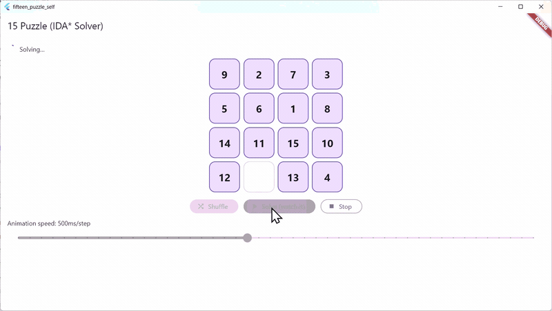

# 15 Puzzle Solver

This is a **self-solving 15-puzzle** built with Dart/Flutter, implementing the **IDA* (Iterative Deepening A*)** algorithm. 

IDA* is an optimal pathfinding algorithm that combines the space efficiency of iterative deepening with the guidance of A* search's heuristic function. It guarantees finding the shortest solution while using minimal memory by exploring depth-limited searches with progressively increasing thresholds.

## Features
- Automatic puzzle solving using IDA* algorithm with Manhattan distance heuristic
- Adjustable animation speed via sliding control bar
- Responsive UI that works across different screen sizes

## Purpose
Built for training and educational purposes to demonstrate:
- Algorithm implementation in Flutter
- Isolate-based computation for responsive UI
- Interactive animations and state management

## License
MIT License