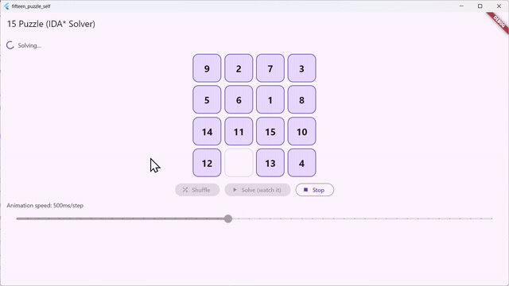

# 15 Puzzle Solver

This is a **self-solving 15-puzzle** built with Dart/Flutter, implementing the **IDA* (Iterative Deepening A*)** algorithm. 

IDA* is an optimal pathfinding algorithm that combines the space efficiency of iterative deepening with the guidance of A* search's heuristic function. It guarantees finding the shortest solution while using minimal memory by exploring depth-limited searches with progressively increasing thresholds.

## Features
- Automatic puzzle solving using IDA* algorithm with Manhattan distance heuristic
- Adjustable animation speed via sliding control bar
- Responsive UI that works across different screen sizes

	<iframe
		src="https://www.youtube.com/embed/QfObmlSvbsU"
		title="15 Puzzle Solver Demo"
		style="position: absolute; top: 0; left: 0; width: 100%; height: 100%; border: 0;"
		allow="accelerometer; autoplay; clipboard-write; encrypted-media; gyroscope; picture-in-picture"
		allowfullscreen
	></iframe>

## Purpose
Built for training and educational purposes to demonstrate:
- Algorithm implementation in Flutter
- Isolate-based computation for responsive UI
- Interactive animations and state management

## License
MIT License
